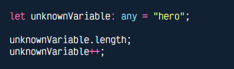
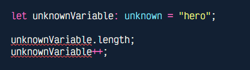
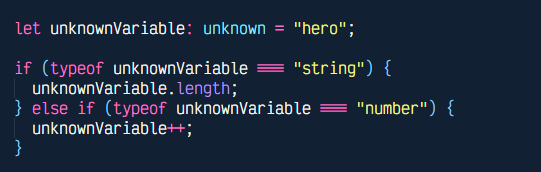
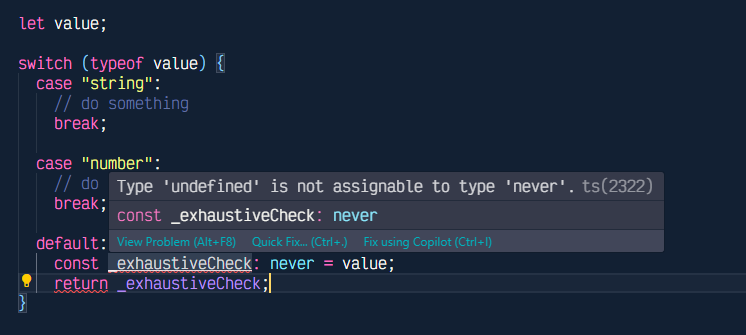

<h1 align='center' >Next Level Web Development - Assignment 1</h1>

<h4 style="font-size: 20px;">To run this code:</h4>

1. Clone this repository:

```bash
git clone https://github.com/MohammadNaiem65/level-2-assignment-1.git
```

2. Install node modules:

```bash
pnpm install
```

3. Install node modules:

```bash
pnpm run dev
```

After editing anything, the dev mode will automatically reload as I implemented hot reload using `ts-node-dev` package.

<h4 style="font-size: 20px; margin-top: 32px;">The Folder Structure of this code is given below:</h4>

```
.
├── src/
│   ├── assets/
│   │   └── interface-vs-type.png
│   └── index.ts
├── .gitignore
├── package.json
├── pnpm-lock.yaml
├── README.md
└── tsconfig.json
```

<h1 align='center' style="margin-top: 3rem" >Questions ans Answers</h1>

<h4 style="font-size: 24px; margin-top: 30px;">1. What are some differences between interfaces and types in TypeScript?</h4>

Interface and Types are two main ways to predefine types in TypeScript. But the key difference of them is, we can only create Object and Array (which is complex to create) type using Interface whereas we can define any type alias of data types available in TypeScript using types.

Another difference is, though types are easy to write or define but interface wins when we take the competition on step farther by merging multiple type alias or interfaces. It turns out that, it's easier for Typescript to compile the hierarchial relationship between interfaces while merging multiple interfaces than type alias.

An example of this can be:

```ts
type Foo = {
  name: string;
};

type Bar = {
  name: number;
};

type Result = Foo & Bar;

type name = Result["name"];
```

If we write this code where we are merging type `Foo` and `Bar`, the type of the `name` key should be both `string` and `number` which is impossible. So we should get and error here.

But if we write this code in the editor, the code not only just runs but the type of the `name` key get infers as `never` which is not expected behavior.

But if we write the same code using `interface`, we will get an error that this this type of merging is not accepted.


What happens here is that, while merging `type  Foo` and `type Bar`, the compilation of these 2 was very complex for TypeScript and we were not getting proper suggestion or warning. But the compilation of the merged `interface Foo` and `interface Bar` was not that complex and we were getting proper TypeScript behavior.

<h4 style="font-size: 24px; margin-top: 30px;">2. What is the use of the `keyof` keyword in TypeScript? Provide an example.</h4>

In TypeScript, the `keyof` operator is used to take an `object` type and return a union (`|`) type of all the keys of that object as literal type. An example of this can be:

```ts
type Product = {
  name: string;
  email: string;
  age: number;
  isSubscribed: boolean;
};

type P = keyof Product;
```

Here the type of `P` will be `"name" | "email" | "age" | "isSubscribed"`. The generated types can be literal type of string or number.

<h4 style="font-size: 24px; margin-top: 30px;">3. Explain the difference between `any`, `unknown`, and `never` types in TypeScript.</h4>

In TypeScript, `any` type means the value of a variable can be anything. Which means we can do anything with that variable, which we might not want. Because by setting the type `any`, we are practically ditching all the benefits TypeScript offers. In most of the cases, where we use type `any`, we may want to use `unknown` there.

Type `unknown` means the value of a variable is unknown. So we will have to be sure what it is before doing anything to it and type `unknown` enforces us to do it where type `any` lets us just "do" the operation. We can see and example below:



In the above example, we see that `unknownVariable` has type `any` and `'hero'` as value. But we can do anything with the `unknownVariable`, like `unknownVariable++` which can't be allowed to done with a type `string`.



But when we set the type of `unknownVariable` as `unknown`, TypeScript don't let's us just do anything and yells at us. If we want to do something, first we will have to make sure or narrow down what the type is and then do any operation like below.



So, we can make a rule of thumb.

1. type `any` lets you do anything you want.
2. type `unknown` restricts you to do anything at all.

<p style="margin-top: 35px;">Now we can discuss about `never`. The type `never` is the last option of any case, which literally means "the value that will never occur".</p>

The type `never` is can be used as the last option of "type narrowing" where we the value of a variable is not expected and it should never be the value. It is mostly useful in exhaustive type checking or for function that doesn't return anything.



In the above example, we can see that we expect the value of variable `value` as type `string` and `number`. So it should not be anything but them (in this case `undefined`). So TypeScript yells at me that the value of `value` can't be undefined and we will have to change it to work.
